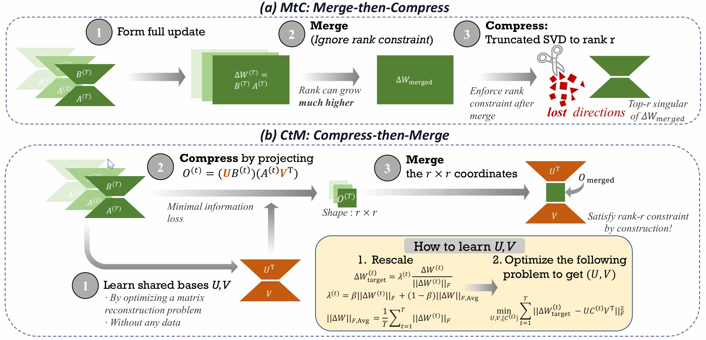

# 🧩 Compress then Merge: From Multiple LoRAs into One Low-Rank Adapter

[](https://github.com/ZhengbaoHe/compress-then-merge/stargazers)[](#citation)[](https://openreview.net/forum?id=p32nWlgwYC)[]()

This repository contains the official implementation of **Compress then Merge (CtM)**, accepted to **ICML 2026**.

## ✨ Highlights

- **Compress-then-Merge pepiline**: enforces the low-rank constraint before adapter merging.
- **Single low-rank LoRA output**: produces a rank-constrained LoRA by construction.
- **Robust merging**: improves stability over post-hoc compression baselines.
- **Compatible with existing LoRA workflows**: designed for standard Transformers + PEFT environments.

## 🔍 Overview

We study the problem of merging multiple task-specific LoRA adapters into a single low-rank LoRA. This setting is important for multi-task deployment, adapter reuse, and efficient downstream adaptation, where the merged model should remain lightweight and modular rather than becoming a full dense update.

A common pipeline is **Merge-then-Compress (MtC)**: first merge adapters in the full parameter space, then apply truncated SVD to obtain a rank-constrained LoRA.

We propose **CtM**, which reverses this order. CtM first learns shared low-rank subspaces from the LoRA weights, projects each adapter into a compact coordinate space, and then performs merging in that space. By enforcing the rank constraint before merging, CtM produces a rank-r LoRA by construction and improves robustness over post-hoc compression baselines.

<p align="center">
  
</p>

<p align="center">
  <em>Overview of Compress-then-Merge: low-rank compression is performed before adapter merging.</em>
</p>

## 🗂️ Code Structure

- `task_merger.py`: core implementation of the merging pipelines.
- `eval_scripts_clean/`: evaluation entrypoints for the vision and NLI experiments.
- `training_scripts/`: scripts for training task-specific LoRA adapters.
- `configs/`: experiment configurations, including model, dataset, and merging settings.
- `dataset/` and `models/`: dataset processing utilities and model wrappers.

In this codebase, the main CtM pipeline corresponds to `merge_space=low_rank_core`. MtC-style baselines are evaluated by merging in `full`, `knots`, or `core` space, and then applying post-hoc low-rank truncation with `--low_rank=1 --lora_rank=16`.

## 🚀 Getting Started

#### ⚙️ 1. Installation 

This codebase is designed to run in a standard Transformers + PEFT environment and does not rely on a specialized software stack beyond the usual dependencies for LoRA training and merging. For users who would like to set up the environment from scratch, the following commands provide a simple reference setup.

```bash
conda create -n ctm python=3.10
conda activate ctm
pip install -r requirements.txt
```

#### 📦 2. Prepare Data and Checkpoints 

**Datasets**: We follow the setup of [core-space-merging](https://github.com/apanariello4/core-space-merging/tree/main) for preparing the models and datasets used in this repository, where most resources can be downloaded automatically. For datasets that still require manual download or additional preprocessing, please refer to the discussions in [Github Issue 1](https://github.com/pytorch/vision/issues/7545#issuecomment-1631441616) and [Github Issue 2](https://github.com/mlfoundations/task_vectors/issues/1). 

**Checkpoints**: We use the checkpoints released by [KnOTS](https://github.com/gstoica27/KnOTS). The required models can also be downloaded automatically when running the scripts.

#### ▶️ 3. Run

To reproduce the results in the paper, run the following command.

```bash
python eval_scripts_clean/8vision_pertask_linearsearch_layers.py \ ## for CLIP 
    --config=vitB_r16_linearsearch_universal.py \
    --merge_method=ties \
    --merge_space=low_rank_core \ # For our compress-then-merge
    --representation=matrix_per_layer \
    --isotropize=0 \
    --low_rank \
    --lora_rank=16 \
    --beta=0.25 --scaling_coeffs=0.75 --topK=25 \
    --only_eval
```

To search hyperparameters on the validation split, run:

```bash
python eval_scripts_clean/8vision_pertask_linearsearch_layers.py \
    --config=vitB_r16_linearsearch_universal.py \
    --merge_method=ties \
    --merge_space=low_rank_core \ # For our compress-then-merge
    --representation=matrix_per_layer \
    --isotropize=0 \
    --low_rank \
    --lora_rank=16
```

For other single-LoRA-output baselines, use the following configuration template:

```bash
## merge_method=ties/dare-ties, isotropize=0, merge_space=full/knots/core for TIES/DARE-TIES in Full/KnOTS/CoreSpace
## merge_method=sum, isotropize=1, merge_space=full/knots/core for Iso-C in Full/KnOTS/CoreSpace
## merge_method=iso-cts, isotropize=0, merge_space=full for Iso-CTS
## merge_method=robustmerge, isotropize=0, merge_space=robustmerge for RobustMerge
## merge_method=lego, isotropize=0, merge_space=lego for LoRA-LEGO
python eval_scripts_clean/8vision_pertask_linearsearch_layers.py \
    --config=vitB_r16_linearsearch_universal.py \
    --merge_method=$merge_method \
    --merge_space=$merge_space \
    --representation=matrix_per_layer \
    --isotropize=$isotropize \
    --low_rank \
    --lora_rank=16
```

Remove `--low_rank` and `--lora_rank=16` to produce full-weight results.

<a id="citation"></a>

## 📚 Citation

```latex
@inproceedings{he2026compress,
    title={Compress then Merge: From Multiple Lo{RA}s into One Low-Rank Adapter},
    author={Zhengbao, He and Ruiqi, Ding and Zhehao, Huang and Ruikai, Yang and Tao, Li and Xiaolin, Huang},
    booktitle={Forty-third International Conference on Machine Learning},
    year={2026},
    url={https://openreview.net/forum?id=p32nWlgwYC}
}
```

## 🙏 Acknowledgements

This repository builds on the codebase of [KnOTS](https://github.com/gstoica27/knots) and [core-space-merging](https://github.com/apanariello4/core-space-merging). We thank the authors for releasing their code and checkpoints.